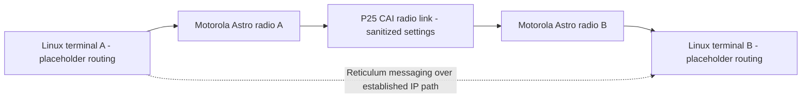
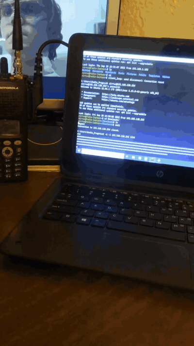
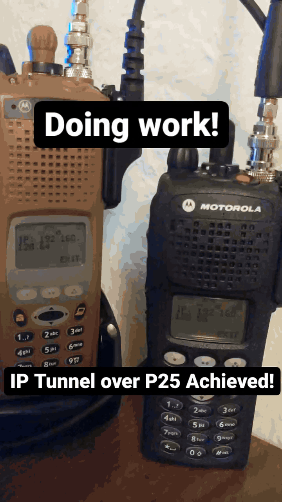
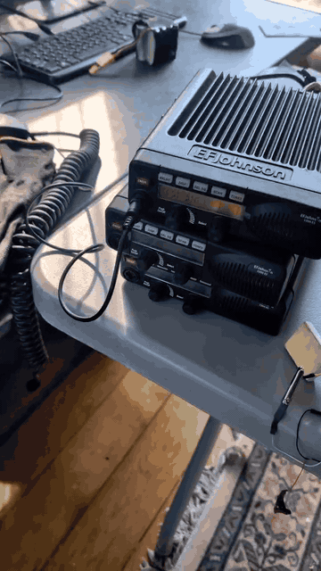
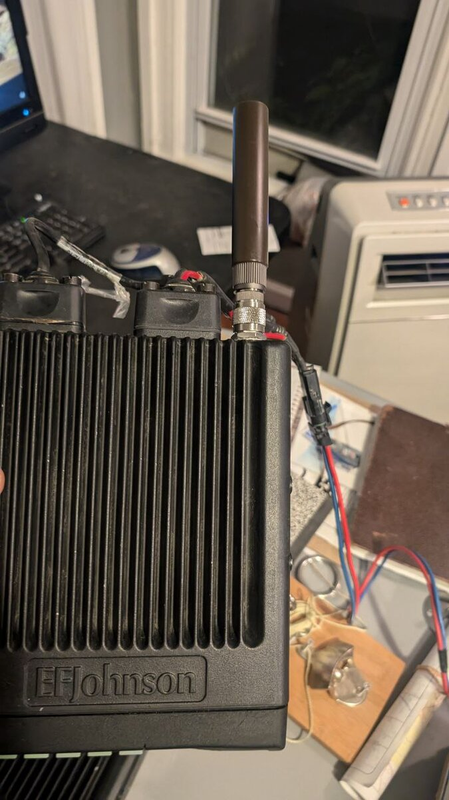
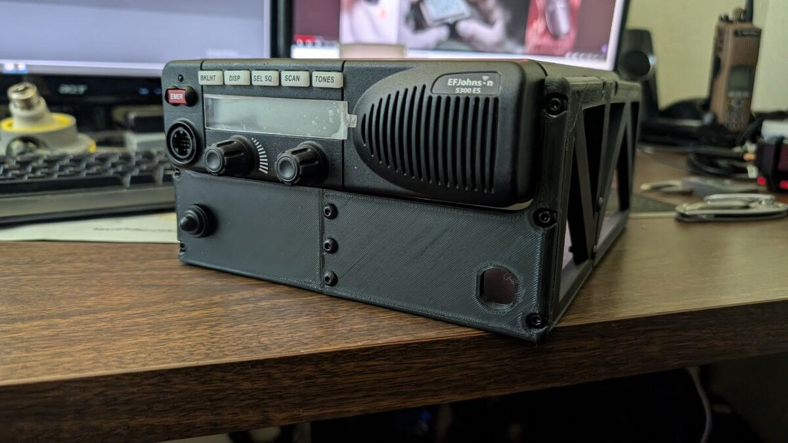
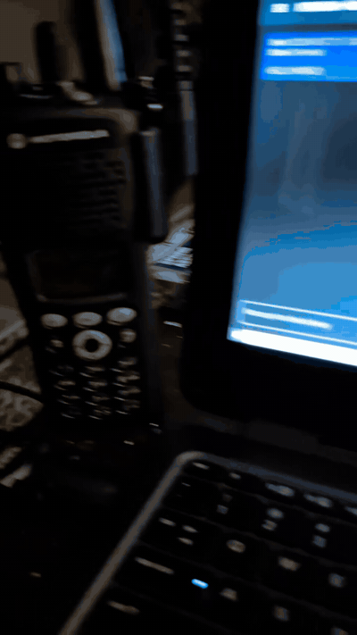
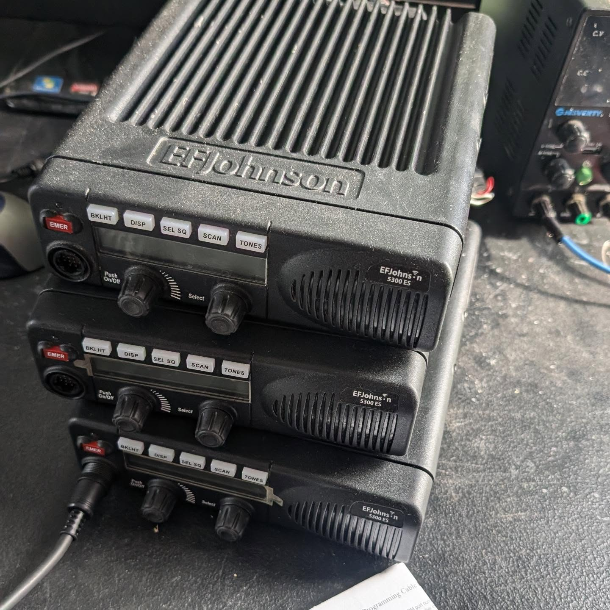

# P25 Reticulum Radio IP Lab

Public-safe project case study for P25 radio-linked IP experimentation, constrained networking, and tactical-radio integration research.

## Purpose

Public-safe investigation into P25 CAI behavior, vendor implementation differences, and constrained IP networking over radio-linked paths. The repo compares Motorola Astro and Harris XG-100M behavior, then uses Reticulum as an application-layer messaging test above an established IP-over-P25 path.

*P25 CAI is the standardized over-the-air radio interface within the Project 25 / TIA-102 family; it defines how compliant subscriber radios and infrastructure exchange digital voice and data over the RF link, separate from higher-level network applications.*

## Key Results

- Demonstrated radio-linked IP using a Motorola XTS5000 and XTS2500 with terminal-data configuration work.
- Established PPP links between Linux terminals and radios using standard programming serial cables.
- Tested Reticulum messaging and low-resolution image transfer above a stable IP-over-P25 path.
- Documented Harris XG-100M trunked-system dependency as a useful constraint.
- Excluded frequencies, IDs, codeplugs, keys, and private addressing from the public repo.

## Project Outcomes

The repo makes the main lesson easy to see: P25 data behavior is not universal across vendors or architectures. Motorola XTS5000/XTS2500 testing produced the strongest direct radio-to-terminal path so far, using terminal-data configuration, PPP, ping troubleshooting, and custom Linux routing. Harris XG-100M software points toward trunked-system dependency for terminal-data operations, while EFJohnson comparison depends on obtaining or fabricating the accessory cable needed for physical serial PPP access.

## Resume Bullets

- Researched APCO P25 CAI behavior and vendor implementation differences across Motorola Astro, Harris XG-100M, and planned EFJohnson platforms.
- Configured Linux PPP/routing workflows for Motorola XTS5000/XTS2500 radio-linked IP testing.
- Tested Reticulum messaging and low-resolution image transfer over an established IP-over-P25 path.
- Documented vendor constraints and public-safe architecture while excluding frequencies, radio IDs, codeplugs, key material, and private routing details.

## Current Findings

The strongest path so far is Motorola Astro radio-to-terminal IP experimentation. A Motorola XTS5000 and XTS2500 were configured through multiple terminal-data codeplug hypotheses, then connected to Linux terminals over PPP using standard programming serial cables. IGMP ping and additional ping testing verified Linux-to-radio and terminal-to-terminal reachability, while custom routing proved necessary: each Linux terminal had to use its connected radio as the default gateway.

The comparison work is equally important. Harris XG-100M configuration software showed that the terminal-data behavior being investigated depends on a trunked P25 network, making Harris a useful constraint case. EFJohnson 5100/5300 remains the next comparison target once the required accessory cable for physical serial PPP access is obtained or fabricated.

## Problem

MANET products show what modern field networking can look like when radios, encryption, routing, and tactical software are designed as one system. Civilian-accessible equipment is more fragmented. P25 radios are available on the secondary market and support encrypted digital voice in lawful configurations, but that does not automatically mean they are practical IP transports.

In practice, the useful question is narrower:

- What does the P25 CAI standard actually support?
- Which capabilities are implemented differently by vendor and product line?
- When can two radios support data/IP behavior directly?
- When does IP networking depend on trunked infrastructure or system-side services?
- What terminal-side routing, addressing, and interface configuration are required?
- Can any civilian-accessible radio path become a realistic transport layer for TAK-style field workflows?

This repo captures that investigation without presenting it as a finished operational network.

## Approach

1. Start with the P25 CAI standard and public technical references.
2. Compare brand behavior rather than assuming all P25 radios expose the same data features.
3. Test Motorola Astro-series workflows first because that is where the radio-to-laptop path is currently most developed.
4. Use Linux PPP, IGMP ping, and normal ping testing to separate radio-link reachability from terminal-routing mistakes.
5. Use Harris XG-100M testing as a comparison point for trunked-system dependency.
6. Use Reticulum as a transport-layer-agnostic, decentralized messaging test over an established IP-over-P25 link.
7. Keep screenshots and clips private until anything sensitive is redacted.

## Project Sections

### Motorola Astro / Radio-To-Terminal Workflow

The Motorola Astro work is the strongest radio-to-terminal path in the project so far. One Motorola XTS5000 and one Motorola XTS2500 were used to demonstrate IP networking after several terminal-data codeplug configurations were tested to find a working configuration hypothesis.

The core hands-on workflow was radio-to-terminal PPP over standard programming serial cables. Linux-to-radio connectivity was checked with an IGMP ping utility, then additional ping testing was used to troubleshoot the path from one Linux terminal, through its connected radio, across the adjacent radio, and into the adjacent Linux terminal. The key configuration finding was routing: each Linux terminal had to use its connected radio as the default gateway, and the link had to be treated as a constrained transport rather than a normal LAN.

 

The front-panel clips add context around the Motorola Astro/mobile-radio configuration work. They stay private until displays and surrounding details are checked for anything that should not be published.

 

 

### Reticulum Test

*Reticulum is a cryptography-based networking stack for building local or wide-area networks over available transports, including very low-bandwidth or high-latency links; in this project it is treated as an application-layer messaging test running above an already established IP-over-P25 path.*

Reticulum was used because it is transport-layer agnostic and decentralized: it can operate above whatever link can move packets, rather than requiring a normal LAN-like environment. In this project, Reticulum was configured to use UDP broadcast across the PPP radio interface after the IP link was stable. UDP was the right fit for this test because connectionless datagrams map better to constrained radio behavior than a persistent stream.

That distinction matters. Reticulum is not acting as a native P25 CAI implementation here, and this is not a finished field network. It is an application-layer test: once an IP path existed over P25, Reticulum gave a practical way to test basic text messaging and low-resolution image transfer over that constrained transport.

### Harris XG-100M Comparison

Harris XG-100M testing produced an important constraint: the configuration software indicated that terminal-data operations require a trunked P25 radio network rather than a simple direct radio-to-radio terminal network.

That result is useful because it keeps the project honest. The point is not to say "P25 IP works" as a blanket statement; vendor, model, and system architecture matter.

### Future EFJohnson Comparison

Future work should include EFJohnson 5100/5300 testing to compare another major P25 vendor family against the Motorola and Harris findings. EFJohnson testing requires obtaining or fabricating the special accessory cable needed for physical serial access before PPP testing can be attempted.

## What This Covers

- P25 CAI standards research.
- Multi-vendor radio behavior comparison.
- Motorola Astro-series P25 familiarity.
- Harris XG-100M constraint testing.
- Reticulum messaging tested over an established IP-over-P25 link.
- Linux terminal networking and manual routing awareness.
- Constrained-networking judgment: bandwidth, routing, infrastructure dependency, and operational limits.
- Careful handling of sensitive communications details.

## What This Is Not

This repository is not presenting:

- a production P25 IP deployment
- trunked-system administration access
- published operational frequencies, talkgroups, radio IDs, codeplugs, or encryption material
- a complete Reticulum-over-P25 field network
- Reticulum as a native P25 CAI implementation
- a completed TAK-over-P25 transport layer
- universal P25 vendor behavior

The scope is narrower: this is a documented research and test effort around P25 CAI implementation differences and constrained radio-linked IP workflows.

## Current Media

- Active media assets: 11
- JPG stills: 5
- Animated GIFs: 6
- Source posture: public-safe derivatives only; source material and sensitive details remain out of scope.

See [docs/evidence-gallery.md](docs/evidence-gallery.md) for the media gallery and [evidence-manifest.md](evidence-manifest.md) for the current asset list.

## Sensitive Material Boundary

This repository must not publish:

- encryption keys, key-fill files, or key IDs
- proprietary radio programming files, codeplugs, or restricted manuals
- operational frequencies, talkgroups, radio IDs, serials, or unit IDs
- private routing details tied to real systems
- screenshots exposing sensitive radio configuration
- trunked-system details that imply access to non-public infrastructure
- credentials, certificates, tokens, or private network identifiers

Public diagrams should use placeholders and recreated examples only.

## Next Work

- Write a short P25 CAI research note summarizing standard-level findings in public-safe terms.
- Add a sanitized Harris XG-100M comparison note explaining the trunked-system dependency finding.
- Build an EFJohnson 5100/5300 test plan before adding that vendor to the comparison.
- Add a short terminal-routing note using placeholder addresses only.
- Review every GIF/still for visible radio IDs, frequencies, serials, terminal hostnames, paths, and private network details.

## Review Docs

- [Evidence gallery](docs/evidence-gallery.md)
- [Evidence manifest](evidence-manifest.md)
- [Sanitization notes](docs/sanitization-notes.md)
