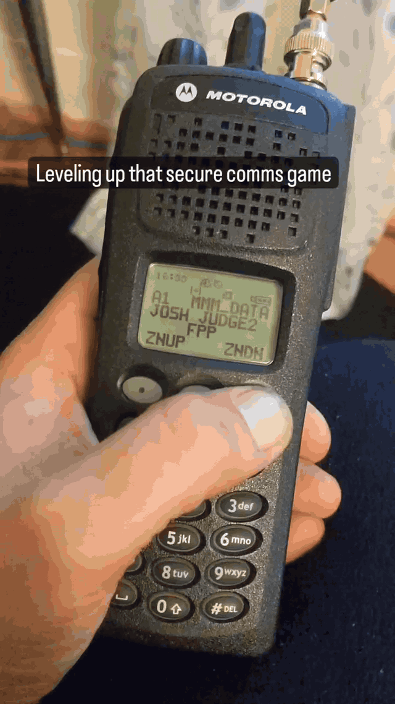
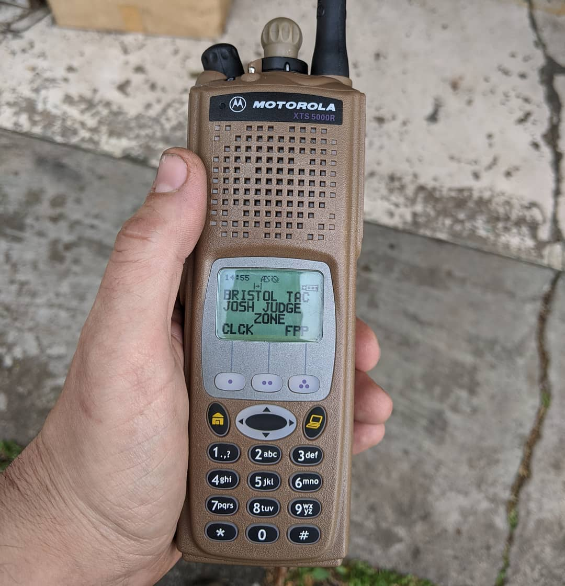
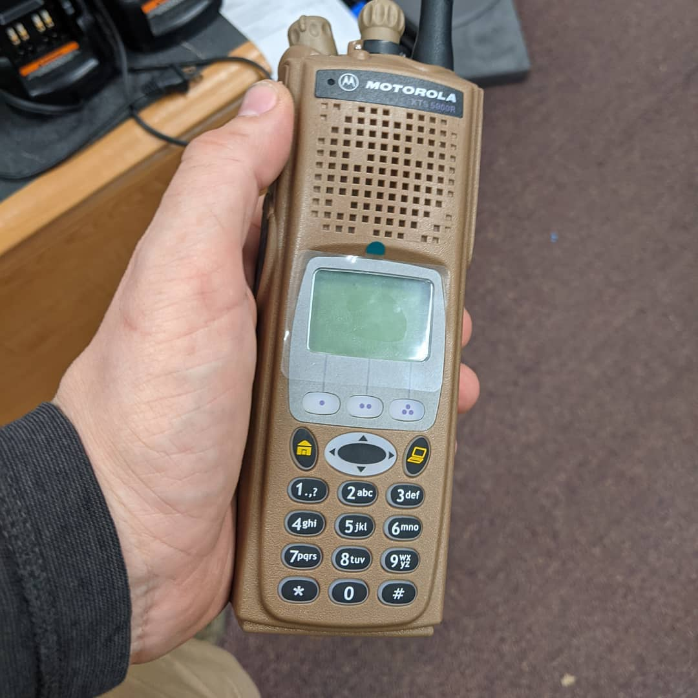

# Evidence Gallery

Public-safe gallery derived from a private source archive.

Media rule: still evidence is stored as JPG; verified video evidence is stored as animated GIF.

## P25 Radio Laptop Terminal Evidence Missed By Caption

- Source: Private source archive; public-safe derivative

## P25 Radio Laptop Terminal Evidence Missed By Caption

- Source: Private source archive; public-safe derivative

## P25 Radio Laptop Terminal Evidence Missed By Caption

- Source: Private source archive; public-safe derivative

## Motorola Astro Selected Video Evidence

- Source: Private source archive.
- Boundary: radio display details, IDs, frequencies, and key material are kept out of the public narrative.

 

## P25 Mobile Radio Selected Photos

- Source: Private source archive.
- Boundary: radio display details, labels, and surrounding private workspace details are kept out of the public narrative.

 

## Stack Of Handheld Radios Transceivers

- Source: Private source archive; public-safe derivative

## P25 Ip Reticulum

- Source: Private source archive; public-safe derivative

## Xts5000 Active Display

- Source: Private source archive; public-safe derivative

## Xts5000 Hardware

- Source: Private source archive; public-safe derivative

